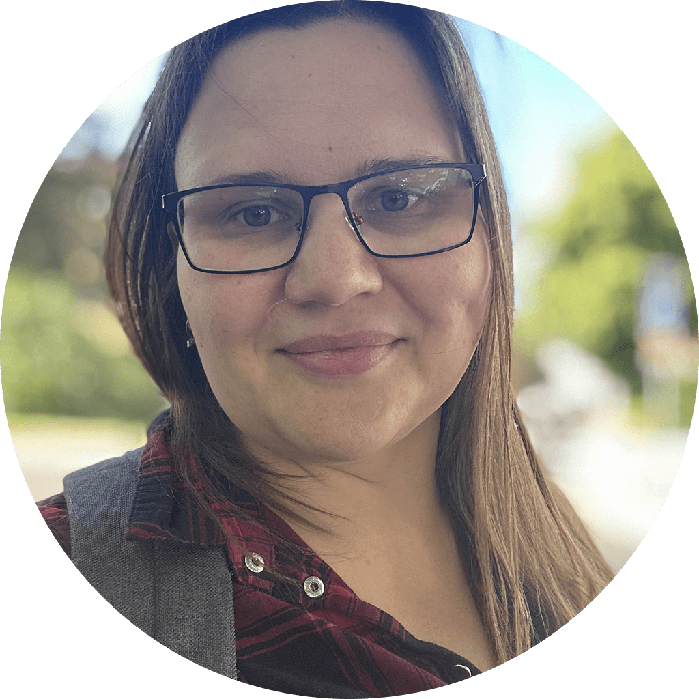

# Three times the charm

I am a strong believer that every person has a certain "core" aspiration.
Not in the sense of an obligatory grand mission, I hope, but more like a genuine interest in a particular concept, area or idea.
I think this "core" is essential for our self-realization and thus drives us towards particular domains, projects and people.

Looking back, I can clearly see that Great Little Software has not appeared out of nowhere. I could trace the idea of diverse solopreneurs back to 2011. The little web studio I had in Russia never really grew into this vision: wrong time, wrong country and a founder that had a long road ahead are probably the core reasons it didn't work out.

Then over a decade later, already in Sweden, when I discovered neurodiversity — empowered by the "not broken, just different" framing — I tried to take a stab at doing it again. I published a few very personal articles that resonated. I never quite fit into the neurodivergent "camp" — I was driven and ambitious and, apparently, I was very good at managing my "undeniable autism".

I tried to help, but I didn't know enough about leadership and I was a bit too cocky to think that I could "cure" executive dysfunction with well-meaning words. My assumption that I got it easy because I knew how to code and could work from home turned out to be not entirely correct. Frustrated with the lack of progress and not feeling that I belong to neurodivergent community, I've wiped any mention of en-di.

I love the story of Stewart Butterfield, where he tried to build an endless collaborative game twice, failed twice, and accidentally built Slack. I find that reassuring.

And so, now I'm building Great Little Software.

## Those pesky values

There are easier ways to make money or to make a name for oneself. Wouldn't it be so much easier to overcharge people who are already stretched thin, exaggerate product capabilities and use "harmless" social-engineering tips & tricks like fake discounts?

It probably is easier, though I think humanity is reaching its limit at tolerating those things. For me, these are non-negotiable:

- Software must be simple, obviously awesome and complete
- The value of the software must be significantly higher than its price
- All humans, but in this context: software creators, deserve to live comfortably doing what fulfils them

And these are the criteria for Great Little Software.

## The 50 Years Plan

Imagine being paid a salary to work on your own product from the comfort of your own home (or an office, if they prefer) with a team of other people who work on their own projects. They help each other and when one succeeds — the whole company benefits from it, not the investors. And if a person or a team wants to eject — they're more than welcome to, then the cradle company continues to benefit from its investment portfolio, allowing it to hire more builders and fund more projects.

I am well aware that building such a grand vision will take a very long time. I spent the last 1.5 years trying to build and bring my own little app to market, reading every book about marketing I can get my hands on and trying to apply it all with intermittent success.

Unfortunately for me, Great Little Software is what I want to spend the rest of my life on and so I would have to figure it out.

Before a portfolio of projects can pay anyone else's salary, I have to learn how to make small ethical projects profitable.

Obviously, Great Little Software isn't built in a day.

Every interview and every published article directly contribute to the mission: support small independent software creators.

Their stories are a source of motivation and joy, and also an opportunity to learn from their experience and wisdom.

And if my articles get a solo developer and their great little software some much-needed exposure — then it is already all well worth it.

<cite>Valeria Viana Gusmao,
 Founder of Great Little Software
</cite>
