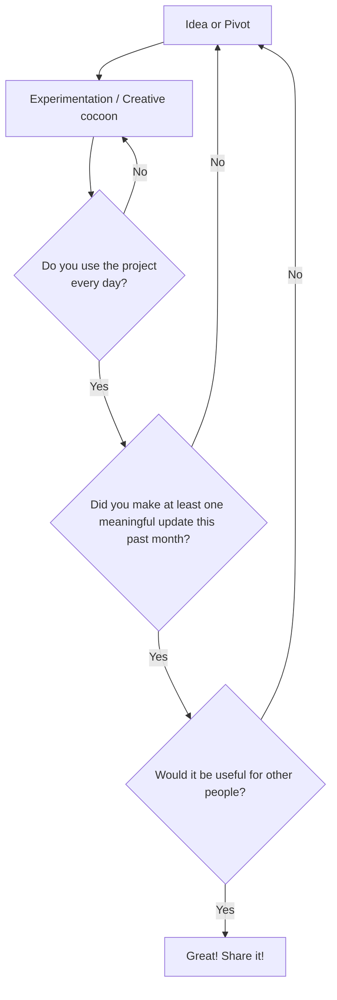

> "You can measure your worth by your dedication to your path, not by your successes or failures."
> -- <cite>Elizabeth Gilbert, Big Magic: Creative Living Beyond Fear</cite>

I can't argue that Elizabeth Gilbert knows a thing or two about passion projects, after all she has written quite a few books, including her well-known memoir "Eat, pray, love". But what I will argue with is where ideas come from.

She describes ideas as disembodied energy forms that are floating around in the search for a human partner that would bring them to life. As romantic as it is, I think it's about time we, humans, took accountability for our own ideas instead of claiming that some mythical creatures hit us with them.

The way I see it - an _idea_ is a result of creative thinking. Our senses supply us with enourmous amount of information all the time and our brains are trying to catch up and make sense of it all. We try and match new information with the patterns we already know and get quite stressed when we are met with something entirely new.

And we get quite pleased when we encounter something that matches one of our favourite patterns. So pleased, that we dedicate our time generously to whoever or whatever keeps matching these patterns and call them passion projects.

## How to come up with an idea for a passion project

Based on the interviews I've had with software creators who successfully kept their passion projects alive for years and my own experience, the secret recipe to coming up with a creative idea includes only two ingredients:

- Deep personal connection to a problem or a domain (a.k.a. passion)
- Intentional limitations

### Find where your passion lies

A common advice is to look around you, but I find it much more effective to search for ideas in the past experiences first. Find a quite place and ask yourself:

- When was the last time I felt alive and excited?
- What was I doing then? Where and with whom?
- Can I think of any other time when I was in a similar situation and was just as excited?

It is very important to not judge any ideas you'll get just yet. Nothing is too silly or too ambitious at this point. Just take note of what comes and keep an open mind. The goal here is to narrow the problem and domain space for your passion project, not to get all the answers.

When you have a potential candidate - something you were excited about in the past, imagine yourself doing it again. Do you still feel excited about it?

Spend as much time as you need, explore different scenarios and try them on.
And when you notice that you're circling the same space over and over again - then you know you're close.

Here's an example:

Let's say you were thinking about all the places you visited in your travels; and those memories filled you with joy and excitement. You remembered the people you met, the places you saw, the food you tasted or the adventures you had. And the thought of dropping it all and going on a year long trip around the world makes you happy.

Or, like it would be in my case, you would be coming back to the feeling of flow when you were building a software project and the feeling of joy of solving problems with it. Or that time when the server crashed and someone complained about it (because that meant that they were using it!). As opposed to the thought of travelling - that would make me slightly bored and annoyed - the thought of spending my vacation in front of a laptop creating tiny digital worlds fills me with joy.

It can be anything really. As Robert C. Martin wrote in his manifesto "We, the Unoffended":

> (We) Believe that, in order for the best ideas to rise to the top, all ideas must be heard and evaluated on their merits...(and) Believe that ideas are not harmful, so long as they do not specifically incite harmful actions.

So explore, dream and let yourself call all the shots.

### Distill into an idea

Knowing what you are passionate about is the most important prerequisite for a passion project, but it still isn't an actionable idea yet. So far it's just a vague area and a feeling. And one that is quite disconnected from reality still.

So, when you've settled onto an area you're passionate about, start intentionally limiting the scope and grounding the project. Ask yourself:

- What am I already good at that could help me in this area?
- What would I enjoy learning?
- What would I absolutely hate doing?

Feel free to go into as many details as you'd like: think about tooling, colors, concepts and anything else. The goal is to make the project idea a little bit more concrete, layer by layer.

You can, of course keep it theoretical, if you prefer, but I find it most efficient to jump into something tiny and try it out. No commitment yet, just a quick one evening or weekend experiment that you're ready to throw away.

There's no saying how much time the whole "coming up with a passion project" process would take: you might loose interest or discover something that would prevent you from continuing working on the project and you'll go back to the drawing board. This is a normal part of the process. And it is very important that you give yourself freedom to explore and experiment before you announce your commitment to the world.

## Creative cocoon

The younger the project, the more malleable it is. In the very beginning you still don't know if it would work out or not. You only know that you're interested in it _right now_, not that you're going to stay interested.

Think about it like if it were a flirting stage of a relationship: you like what you see, but you don't know enough about the other person to make a lifetime commitment yet. Flirt with your prototype, flirt with a few of them, don't introduce them to your friends or family just yet and most certainly don't put it on your social media profile.

You want to be able to give yourself time to understand what is important to you and to explore without the pressure. You'll see that some projects might require more of you than you can give, some would turn out to be way less rewarding than you hoped for and that's okay.

I like to call this early stage a "creative cocoon". This is a very vulnerable stage of the project when it transforms rapidly and wildly. This is the time where you figure out your needs and build a relationship with your project. And not every idea would survive this stage.

Inevitably, you will end up with a project that you'll be coming back to over and over again. And you won't be interested in exploring other options.

### Do NOT build in public just yet

Even when you land on the project that you're ready to commit to, resist the temptation to share it with the world until it is ready, as controversial as it might sound.

It's perfectly normal to want to make a living doing what you love. And it is tempting to try and see if this particular project would be the one that allows that for you. And it might, but in order for you to be able to convince others that your project is worth spending money on - you need to have an unshakeable belief in it.

A few years back writing software was taking way more time, so it made sense to try and see if someone would use it before you spend years and months on a project. LLMs made MVPs a commodity. And with the amount of sloppy almost-working project out there, I think it's about time we refine our projects for a little longer before unleashing them into the world.

But you still have to have someone use the project to be able to iterate on it, so I suggest that someone would be... _you_. Obsess about your needs and usage patterns, iterate on your own feedback and get to a stage where you are excited to use your project just as much as you are excited to build it.

You shouldn't feel guilty for building something just for yourself. You don't own the world your every thought, idea and project. And not every thought, idea of project would be a good fit for the rest of the world either.

Worst case scenario: you'll end up with something that makes your life easier and a ton of knowledge.

Whereas if you let other people's ideas and opinions influence your passion project when your vision is still maturing, you'll end up with a Frankenstein monster of lifeless and unfit body parts of someone else's dreams.

But it'll also be a waste to keep your beautiful creation locked away for too long.
So how do you know when the time is right?

## Passion Project Lifecycle

In a nutshell, you want to go through a loop similar to the one below:

The more cycles you go through, the more refined your next iteration would be.
The goal, as you can see, is not to get the project _right_ in one go, but to be able to iterate on it indefinitely and keep the passion alive.

And only when you feel like you have a solid understanding of what your project is and what it would never be - then you are ready to listen to feedback from others.

Not every external idea would be good, not every suggestion is worth implementing.
The more picky you are, the better the resulting project would be.

And, just like it was with your own ideas, you want to listen to feedback coming from people who use your product often and almost religiously. And until you have these people, it's best to draw inspiration from people who use similar products than your friends or family.

Sometimes you would end up with a project that might be too niche or too hard to scale to a larger audience.
And that's okay - depending on why you started the project in the first place it might be perfectly fine to leave it as is and keep enjoying your time together.

It's also perfectly fine to want to make money out of it.
Though I'd recommend to use a slightly different set of metrics than revenue to define the project's success, especially early on.

## How does a successful passion project look like?

In the beginning, you want to end up with a project that you enjoy using, love working on and can keep doing that indefinitely. So at this stage success metrics are how often you use whatever you're building and how often you find time and will to work on it.

If you want a fancy name for it, let's call it:

- **Dogfooding Rate** - the amount of days you actively used your project divided by the total number of days in the period (e.g. once a month 1/30 = 0.033 active usage rate or 3.3%)
- **Change Frequency** - how many new versions you "released" during the same period (e.g. twice a month 2/30 = 0.067 change frequency or 6.7%)

The closer both of these metrics are to 1, or 100%, the better.

As with any infatuation, in the beginning you might spend a lot of time at it and then settle into something more sustainable, so it's important to give yourself at least a month or two before you jump to any conclusions. The trajectory over time is what matters most.

If after the initial "honeymoon" you're still happy to spend time on your passion project and you've settled into a sustainable routine - it's going in the right direction. Don't rush it, the inspiration is not going to dissipate as long as you are engaging with your project.

But you might get discouraged and disappointed if you open up for feedback a bit too early. And that would be a shame, because often it says less about your product and more about people giving the feedback.

It is just a matter of time till you land on a passion project that would become your life's work. Or a few of these. Just like it is with human relationships - we're not limited to only one passion in life, unless we choose to do so. And, inevitably, if you choose to share it, you'll end up with other people using it with the same joy and enthusiasm as you.

They will be just as invested and will contribute their limited resources like time, energy and money to support you.

Because both you and them will know that you mean business and wouldn't abandon the project when the next shiny idea tries to seduce you.
