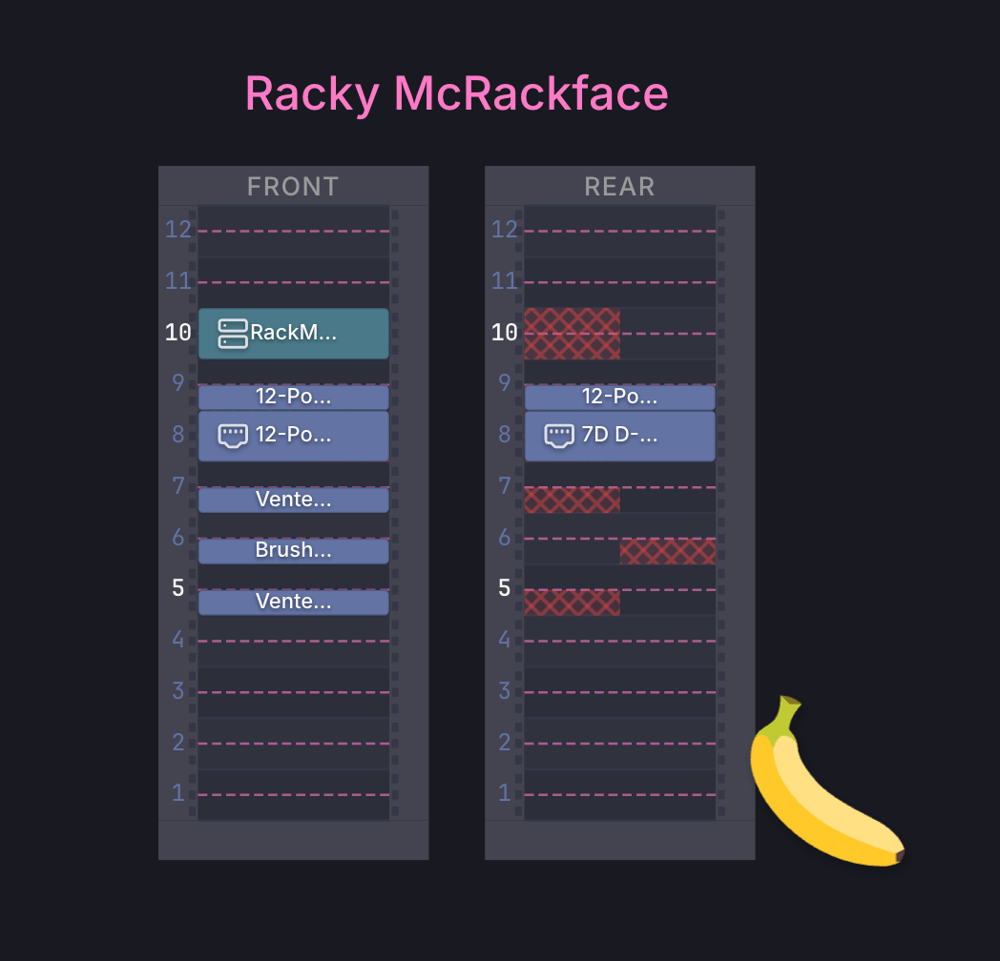

> "There's a new kind of coding I call 'vibe coding', where you fully give in to the vibes, embrace exponentials, and forget that the code even exists. ... I'm building a project or webapp, but it's not really coding — I just see stuff, say stuff, run stuff, and copy paste stuff, and it mostly works."
> -- <cite>Andrej Karpathy, February 2025</cite>

One morning I woke up excited to spend some time on my side-project. I finally had the energy. I'd spent the last week in selfhosted communities and setting up my tiny Intel NUC. Finally I felt that I had an idea how to proceed with the project. I opened OpenCode and 30 minutes after I wanted to throw my project, LLMs and a laptop out of the window and change career to something that doesn't involve saying "NONONO, not like this" to a very annoying program.

I looked at the code and I felt disconnected from it. I knew what it was doing, I reviewed it all, but it felt foreign. The flow was gone and I spent the next few days remembering how to code by hand. I'm happy to report that I've produced the world's most over-engineered counter application: with in-memory storage and APIs for increasing and descreasing the count.

Vibe coding ravaged developer communities. Deliberately and exponentially speeding up copying from Stack Overflow without understanding. But there is a reason I have to rely on AI assisted development and while my LLM detox has been extremely beneficial for mental health, I sought out to find better ways to write software with AI.

And I think Gareth Evans, creator of Rackula, has a lot of experience to share on the topic.

## Rackula. The Beginning.
It started in the end of 2025. In Gareth own words:
> Originally I was looking to help my Dad organize his super messy server rack, which had several big heavy audio amplifiers and networking equipment. I wanted to think about the layout of the rack and the equipment in a more organized way, without moving these awkward and heavy things around more than once. My Dad is a civil engineer, so loves diagrams and planning. I went looking for a tool that would help me visualize the layout of the rack and the equipment. Surprisingly, there were none that met my needs: easy to use, exports images and doesn't lock in data.

Oh, the allure of the side project, just like a siren they deceive us with their simplicity and promises of good time. And LLMs only add oil to the fire:

> If you recall that Nov-Dec 2025 was right when LLM-based tools were really beginning to show that they could be used to build software in a tangible way. So, like many others I was playing with Claude Code just to see what it could do. I initially wanted a way to visualize the rack layout and equipment arrangement and move the items by dragging them around. I also wanted to be able to save it as a format that could be easily shared and imported. It also needed to be able to export the layout as an image.

> I also specifically remember reading Harper Reed's [My LLM codegen workflow atm](https://harper.blog/2025/02/16/my-llm-codegen-workflow-atm/) blog post about how he uses AI to brainstorm and generate the specifications that are then used to prompt the LLM to generate code. So, with the need in mind I spent some time building out my spec and then quite rapidly had a working prototype up and running.

## The Good, The Bad and Safari

Writing code is easy, when you know what to write, with or without LLMs.
Early on Gareth found out that defining the data model and schema was unexpectedly hard: "I realized (eventually) that a well-defined schema was crucial for building a scalable and maintainable system."

I arrived to the same conclusion. LLMs are horrible at designing the software from scratch, but given a starting point and some guardrails it becomes a lot easier to wrangle overly eager coding agents.

I think there's a lot of good materials out there to get inspired by. Rackula's schema, for example, has been inspired by NetBox:
the code structure couldn't be more different, but the conceptual model of what a rack is, what a device is, what properties they have, how they're related are very alike.

And then there's the scope creep. When possibilities are endless, choosing what *not to build* becomes a problem:
"Ideas are easy, it is much harder to limit scope creep. What began as a simple idea quickly grew into a complex system with many moving parts. Initially I wanted to do _everything_ - keep tons of detail about every item"

Looking back Gareth said that if he'd done it all over again, he'd been more diligent about intentionally limiting scope: "I definitely burned some cycles on features that were not necessary for the initial functionality. I had a ton of ideas around modelling networking and power connectivity, which while valuable, were not critical to the core app."

Rome hasn't been built in a day and judging by 1040 commits Rackula has been through a lot of iterations. And to a big part that can be attributed to browser quirks:

> The architecture of Rackula is focused on SVGs in the browser, and dragging and dropping them. Sounds simple, right? Sure, until you try and get consistent behaviour across browsers. Each major browser has its own ideas of how to handle SVGs and drag/drop, leading to inconsistent results. This meant that significant time was spent digging into how one browser's implementation would affect the user experience in another. I have a GitHub issue label "damnit/safari" for a whole slew of Safari/webkit bugs and inconsistencies.

Even the name of the project has changed in the process:
> I initially named it Rackarr, in sort of a playful reference to the *arr suite (Sonarr, Radarr, etc.) and then introduced it to the Reddit community. There was an almost immediate reversion to the name, because it is not truly related to the *arr suite.

## It's all about UI

The core philosophy of Rackula is that it must be intuitive. In creator's own words:
> I'm not sure if I'm there yet, but I wanted it to be a tool that my parents could use: which is a high bar for usability.

The process has definitely been long and non-linear:
> I am not a designer, but do feel like I know when software makes sense (or doesnt). So, my initial layouts were kind of thrown together and would often feel clunky or inconsistent. This led me down a rabbithole of looking at how other canvas-based apps handled UI design and how to make my app feel more fluid. There are still many, many things I would improve if I had more time.

I'm sure that there's more to it, but I do think that the effort placed into Rackula was well worth it.
I, for one, could figure it out and loved the little easter egg of "banana for a scale"  I found in the settings:

## AI vs Humans

I am genuinely impressed by Rackula's quality and I can't help but wonder how much of that can be attributed to Gareth and how much to AI.
And so I asked him for his secret sauce in the hope to apply it to my own projects. Here's what he shared:

> As mentioned earlier, (*I used AI*) extensively, based on Harper Reed and others who espoused AI-first approaches particularly using Test Driven Development (TDD). AI (Claude Code) was used to define the specifications through interative feedback, and then from there define a blueprint and prompt plan for the tests which eventually define the code that makes up the app. If you recall, Anthropic had doubled the usage limits over the Christmas break: this was the gasoline thrown on the fire for me. I was running 5+ agents in parallel churning out tests, code, and definitely could not have done this without AI.

His process sounds a lot like [Kaizen](https://en.wikipedia.org/wiki/Kaizen) to me, or it's derivative, [The Toyota Way](https://en.wikipedia.org/wiki/The_Toyota_Way): the code generation itself might be done by a machine, but the human in control, obligated to pull the cord and stop the production to get the quality right.

But what's even most important, I think, is to build the right thing and for the right reasons.
I asked Gareth about his ambitions for Rackula and, despite the project name, world domination seem to not be on the roadmap:
> Well, before this I had never had a project get really any traction. So, at first the dream was "someone clicks on my thing", and now a few months down the road its at over 1k stars on GitHub. So now, my wildest dream is to have Rackula become a go-to tool for the several communities that use it. Really, what I want is for it to get to the point where it takes on a life of its own. I have already seen several individual contributors putting in PRs and helping shape the project, and I believe there's a lot of potential for Rackula to grow and become a valuable tool for the community.

I think this way, of sustainable AI usage, where creative process remains in the hands of us, humans, is the way forward.
And if somewhere along the way you get inspired to build a server rack - give [Rackula](https://count.racku.la/) a try.

It's a great little software.

