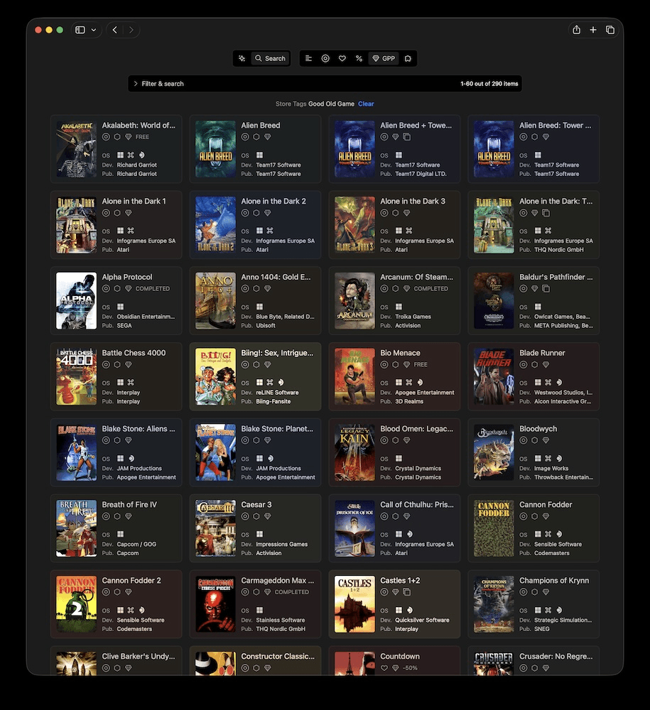
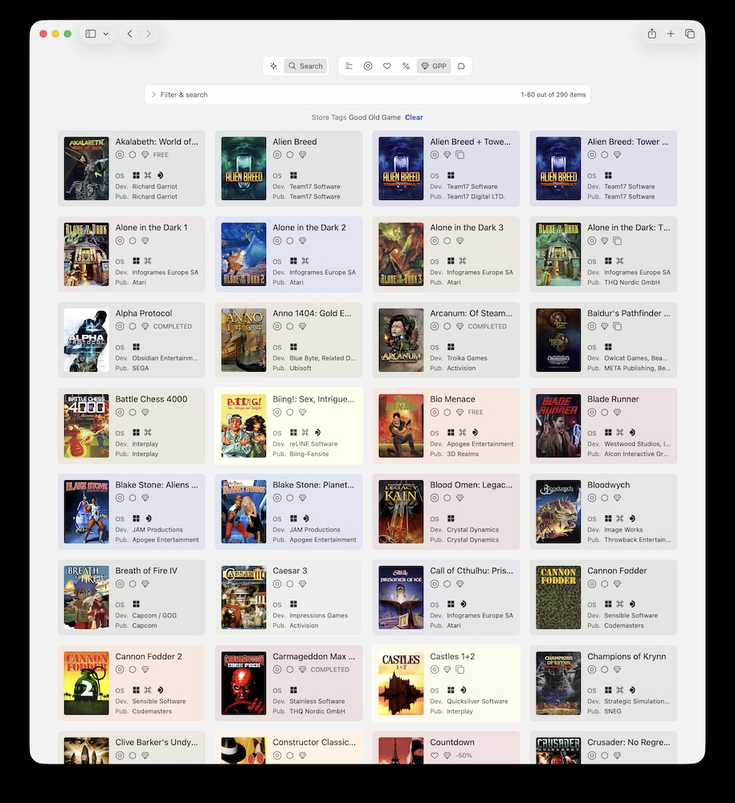

> Theodorus van Gogh (1 May 1857 – 25 January 1891) was a Dutch art dealer and the younger brother of Vincent van Gogh. Known as Theo, his support of his older brother's artistic ambitions and well-being allowed Vincent to devote himself entirely to painting. As an art dealer, Theo van Gogh played a crucial role in introducing contemporary French art to the public.
> -- <cite>Wikipedia</cite>

GOG - Good Old Games - has been created with a mission to Make Games Live Forever, according to their website. But over a decade ago, in September 2010 they disabled their website making users and journalists believe that it has been permanently shut down due to their DRM-free strategy. GOG.com has been down for just a few days and the site's management eventually revealed that it was nothing but a marketing hoax to draw attention to the new version of their website citing being a small team and having a limited marketing budget.

You can imagine the backlash from their fans that followed.

"I can't afford much in a way of physical media collection - I like to build similar digital collections. Naturally, I wanted some way to manage and showcase that games collection. GOG.com poor-taste marketing stunt prompted me to prioritize that" - explained Bogdan (aka [boggydigital](https://github.com/boggydigital)), creator of vangogh and theo.

Local copies of game executables could live forever with or without GOG, but the metadata, descriptions, screenshots and other keepsakes you'd have in a physical copy would be lost. Imagine the Louvre, but all paintings are stashed next to the wall in no particular order.
Games are art and deserve to be treated accordingly, digital or not. This sacred duty falls on [vangogh](https://github.com/arelate/vangogh):

There's a light theme too, if you prefer:

And [theo](https://github.com/arelate/theo), his little brother, is responsible for running the games on MacOS and Linux (Steam Deck).
Clearly, naming comes naturally to Bogdan, I can't think of a better duo with this distribution of responsibilities!

But I imagine building them wasn't easy at all.

## A hobby for decades
"Finding time to invest in such hobby is always challenging against demands of a day job, family and other hobbies." - says Bogdan - "I've been chipping away on vangogh for almost a decade now and can easily see myself working on this until I die - there's an endless supply of ideas and improvements to work on!"

Being motivated by the work itself is impressive and I admire his ability to do it for so long. And while removing the pressure of making profit helped, limited time and unlimited ideas "that have to be rationalized and implemented" are still a challenge.

But Bogdan seem to have cracked the secret of maintaing focus, flow and joy and I think it has something to do with his principles.
Which are:
- "Front end performance/latency should be really good. I don't like using slow websites, so I'm not going to produce one."
- "I don't want to use any third-party dependencies. Practically everything in my projects is bespoke, meeting my personal needs."
- "Services I work on should work really well together and work similarly. If a user learns how to use one service - they should know how to use another one (e.g. vangogh and theo)"

## A passion project

It felt silly asking him about his relationship with AI: like asking Vincent van Gogh if he uses photo camera for his works. But he didn't get offended by my stupid question.

"I don't use AI for development in any way." - Bogdan said, - "Delegating personal passion projects to AI is not the route I'm interested in right now.

Most of the time I spend on those projects is thinking about how to change something to allow for the next idea - typically happens when I'm not near a computer anyway.

If somebody was chipping away on their personal coding projects before the boom of AI - I suspect they continue to chip away in a similar way.

We don't do that to pump the maximum amount of code in the shortest time anyway".

As of today, vangogh has 2118 commits with the first one dated Aug 2, 2020. And by the looks of it its just the top of the iceberg.

AI might've sped up the development, but when there's no market to go to, no investors to please and no expectations except to preserve the art of game development and enjoy the process - why rush indeed?

## What's next

"I've recently got into DRM-free Steam and Epic Games Store games. I've been a die-hard DRM-free user and avoided Steam and EGS, assuming most (if not all) games have some form of DRM, but turns out significant amount of games are DRM-free on those platforms. What's more important for me - significant amount of games _I would like to own/play_ are DRM-free! If I'd known that earlier - I'd build vangogh in a more store-agnostic way. Right now - vangogh is focused on GOG games and theo (client for vangogh) can install games from vangogh, Steam or EGS (those two options bypass vangogh and install directly from the source). I'm working on adding ability to self-host DRM-free Steam and EGS games though and expect this will happen later this year." - shared Bogdan.

As for me, I think the last time I thought about DRM in the games was when you had to buy them on the CDs, after that, to my own shame, I've assumed that DRMs are the necessary evil, and "it is what it is" for a gamer. On vangogh's screenshot, I've noticed "Arcanum" - a steam-punk RPG I never got to finish because the version I was playing was crashing at a certain point all the time. I always wondered how it ends, so perhaps that could be the first one to relive. That is once I get a bigger storage for my home server, my *babynuc*, a refurbed mini PC I use for experiments, couldn't possibly handle the whole GOG collection.

And perhaps get a steam deck with a controller too.
Bogdan is planning to give theo a GUI ("and it should be fast, appealing and work with gamepad") and add cloud saves between theo and vangogh ("a must").

"I'd like to add a server for ROMs (similarly - there's a surprising amount of legal ROMs many people own, so doesn't have to be illegal) that theo can integrate with for a full spectrum of gaming needs." - he continued, "That would be my personal gaming nirvana - completely self-hosted games collection across platforms that you can enjoy on any supported device!"

Give [vangogh](https://github.com/arelate/vangogh) and [theo](https://github.com/arelate/theo) a try and, if you're up for it, make your own contribution to preserving games dev masterpieces.

As theo & vangogh are great little duo.
